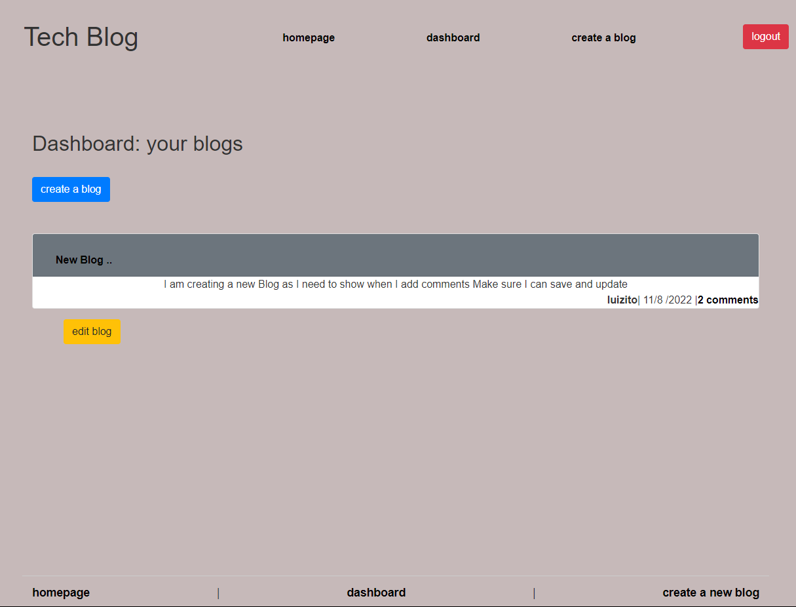

# Tech Blog

* [GitHub repository](https://github.com/luizborges146/create-tech-blog) Link to the repository<br />
* [Video Link](https://drive.google.com/file/d/1QAD2aYwZamD51vWlkyTh14WF6WV8VXq5/view) This is the video showing the application<br />
* [Heroku deployed link](https://techbloglf.herokuapp.com/)

 [](https://opensource.org/licenses/MIT)


    
## Table of Contents
    
1.  [Description](#description)
2.  [Instalation](#instalation)
3.  [Usage Infomration](#usage)
4.  [External support documentation](#externalDoc)
5.  [Tests](#tests)
6.  [Social](#social)
7.  [Plugins](#plugins)
8.  [License](#license)
    
## [Description](#description)

The idea of this application is to a tech blog, where the user is able to create an account, once the accout is created, then the user can create a post or add a comment in the post. The blog also allow the user to delete their own post.

The application follow the MVC (Model-View-Controller), it also apply express handlebars, MySQL2, Sequelize, dotenv, express sessions.





## [Instalation](#instalation)
In order to use test this application, you need to create a create an .env file and add you SQL information to it, once it is done, you will be able to run the db/schema that contain the name of the database.

##### Running the /db/schema.sql

<!-- []  

##### Running the /seeds/index.js
[] -->

Then one seeds folder, there are a data sample that can be used to test the application.
    
## [Usage](#usage)
Simple to use.
 * Functionalities.
   * Create an account.
   * Create post or a comment.
   * Update the post
   * Delete the post
   * Log out from the account.


#### The route below is a delete request to identify a specific post by ID, to be deleted
```
router.delete('/:id', withAuth, async (req, res) => {
    try {
      const blogData = await Blog.destroy({
        where: {
          id: req.params.id,
          user_id: req.session.user_id,
        },
      });
      if (!blogData) {
        res.status(404).json({ message: 'No blog found with this id!' });
        return;
      }
      res.status(200).json(blogData);
    } catch (err) {
      res.status(500).json(err);
    }
  });
  
```

  

## [External support documentation](#externalDoc)
    

- [W3School](https://www.w3schools.com/)<br />
- [Mozilla](https://developer.mozilla.org)<br />
- [READ.me](https://docs.readme.com/docs/linking-to-pages")<br />
- [GitHub](https://pages.github.com/)<br />
- [npm inquirer GitHub link](https://github.com/SBoudrias/Inquirer.js/blob/master/README.md#installation)<br />
- [npm mysql](https://www.npmjs.com/package/mysql2)<br />
- [npm](https://www.npmjs.com/)<br />
- [Template Literals](https://developer.mozilla.org/en-US/docs/Web/JavaScript/Reference/Template_literals)<br />
- [NodeJs - Path.join](https://nodejs.org/api/path.html#pathjoinpaths)<br />

    
## [Tests](#tests)
N/A
    
## [Social](#social)
if you need any further information or support, please, send an email to: luiz.borges.146@gmail.com
    
[](https://github.com/luizborges146) [](https://www.linkedin.com/in/luiz-borges-2377b7142/)
    
    
    
## [Plugins](#plugins)
N/A
    
## [License](#license)
License Information: [MIT](https://opensource.org/licenses/MIT);

Created by Luiz Borges
Please refer to the LICENSE in the repo.